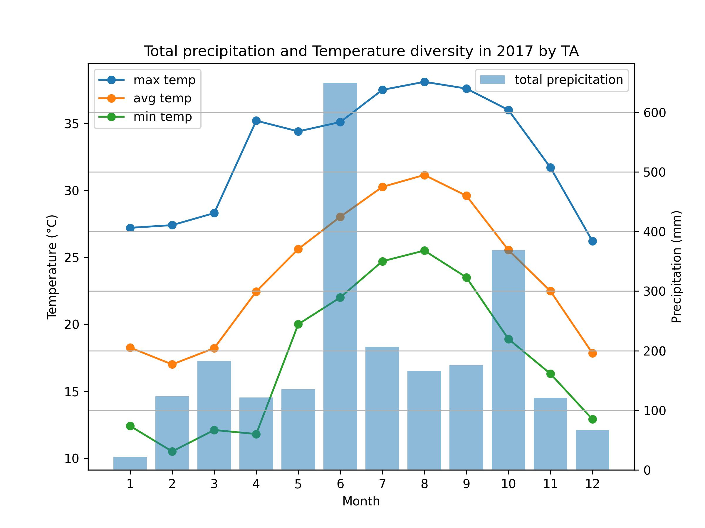

# AP4063 Midterm TA Solution

> AP4063 - Weather and Artificial Intelligence Ⅰ **Midterm** </br>
>
> **Year: 2023 Fall**  
> **Lecturer: Che-Wei Chou (周哲維)**  
> **TA: Hugo ChunHo Lin (林群賀)**
>    
> </aside>

## Q1. Four piles of apples (10%)

There are n apples that need to be divided into four piles. We need two mysterious number x and y. Let The number of first pile equals to x+y, the number of second pile equals to x-y, the number of third pile equals to x*y, the number of fourth pile equals to x/y. We need to calculate how many apples are there in each pile.

Of course, there won't be so many unknowns. We know the total number of apples(n) and the second mysterious number(y).

For example: there are 48 apples need to divided into four piles. y=3. that is, 1st pile should be x+3, 2nd pile should be x-3, 3rd pile should be x*3, 4th pile should be x/3. Do you know how much x is? x should be 9, because:

```
(9 + 3) + (9 - 3) + (9 * 3) + (9 / 3) = 12 + 6 + 27 + 3 = 48
```

So, 48 apples should be divided into 12, 6, 27, 3.

**Implement a function that accepts two argument, n and y, and returns the number of apples in each pile as described above. Each resulting number should be a positive integer. If there's no way to divide the apples, return an empty array/empty value (refer to the function declaration and test cases in your language of choice to see which option is relevant for you).**

```
n = 48
y = 3
result = [12, 6, 27, 3]

n = 100
y = 4
result = [20, 12, 64, 4]

n = 24
y = 4
result = []  (no way to divide the apples)

n = 25
y = 4
result = []  ([8,0,16,1] is not a correct answer since you can't have empty piles)
```

### Solution

```py
def four_piles(n, y):
    piles = []
    
    for x in range(1, n):
        if (
            x + y > 0 and 
            x - y > 0 and 
            x * y > 0 and 
            x % y == 0 and 
            x // y > 0
        ):
            if n == (x + y) + (x - y) + (x * y) + (x // y):
                piles = [
                    (x + y),
                    (x - y),
                    (x * y),
                    (x // y)
                ]
                return piles
    
    return piles
```

## Q2. Decoding a message (15%)
You have managed to intercept an important message and you are trying to read it.

You realise that the message has been encoded and can be decoded by switching each letter with a corresponding letter.

You also notice that each letter is paired with the letter that it coincides with when the alphabet is reversed.

For example: "a" is encoded with "z", "b" with "y", "c" with "x", etc

You read the first sentence:


```
"r slkv mlylwb wvxlwvh gsrh nvhhztv"
```
After a few minutes you manage to decode it:


```
"i hope nobody decodes this message"
```
Create a function that will instantly decode any of these messages

You can assume no punctuation or capitals, only lower case letters, but remember spaces!


### Solution

```py
def decode(message):
    alphabet = 'abcdefghijklmnopqrstuvwxyz'
    reversed_alphabet = alphabet[::-1]  # Reversed alphabet
    
    decoded_message = ''
    
    for char in message:
        if char == ' ':
            decoded_message += ' '  # Preserve spaces
        else:
            index = reversed_alphabet.index(char)
            decoded_message += alphabet[index]
    
    return decoded_message
```

## Q3. Distance from the average (15%)
Given a starting list/array of data, it could make some statistical sense to know how much each value differs from the average.

If for example during a week of work you have collected 55,95,62,36,48 contacts for your business, it might be interesting to know the total (296), the average (59.2), but also how much you moved away from the average each single day.

For example on the first day you did something less than the said average (55, meaning -4.2 compared to the average), much more in the second day (95, 35.8 more than the average and so on).

The resulting list/array of differences starting from [55, 95, 62, 36, 48] is thus [4.2, -35.8, -2.8, 23.2, 11.2].

Assuming you will only get valid inputs (ie: only arrays/lists with numbers), create a function to do that, rounding each difference to the second decimal digit.

### Solution

```py
def distances_from_average(test_list):
    # Calculate the average
    average = sum(test_list) / len(test_list)

    # Calculate the signed distances from the average, rounded to 2 decimal places
    differences = [round(average - value, 2) for value in test_list]

    # Convert floating point number 0.0 to integer 0
    differences = [0 if diff == 0.0 else diff for diff in differences]

    return differences
```

## Q4. Multiply the number (10%)
Jack really likes his number five: the trick here is that you have to multiply each number by 5 raised to the number of digits of each numbers, so, for example:

```
multiply(3)==15 # 3 * 5¹
multiply(10)==250 # 10 * 5²
multiply(200)==25000 # 200 * 5³
multiply(0)==0 # 0 * 5¹
multiply(-3)==-15 # -3 * 5¹
```

### Solution

```py
def multiply(n):
    if n == 0:  # If the number is 0, the result will be 0 regardless of its digit count
        return 0

    # Calculate the power of 5 raised to the number of digits in the absolute value of the input number
    power = abs(n)
    power_of_five = 5 ** len(str(power))

    # Multiply the number by the calculated power of 5 and return the result with the sign of the input number
    result = n * power_of_five
    return result

print(multiply(10))  #250
print(multiply(5))   #25
print(multiply(200)) #25000
print(multiply(0))   #0
print(multiply(-2))  #-10
```

## Q5. **466920.csv** 為臺北測站 2017 / 01 / 01 ~ 2018 / 11 / 30 之觀測資料，**information.txt** 為欄位說明，將 csv 利用 pandas 讀成 DataFrame 後(5%)完成以下小題。

```py
import pandas as pd

file_path = "./466920.csv"
df = pd.read_csv(file_path)
"""
-9991 儀器故障待修無資料,
-9996 資料累計於後,
-9997 因不明原因或故障等因素無資料,
-9998 雨跡(Trace),
-9999 未觀測而無資料
"""

df = df.replace(-9991, 0)
df = df.replace(-9996, 0)
df = df.replace(-9997, 0)
df = df.replace(-9998, 0)
df = df.replace(-9999, 0)

df_2017 = df[df['year'] == 2017]
```

### Q5-1. 計算 2017 年全年均溫及累積降雨量 (5%)

```py
year_avg_temp = df_2017['TX01'].mean()
year_total_prep = df_2017['PP01'].sum()
```

### Q5-2. 計算 2017年 1~12月各月月均溫及累積降雨量 (5%)

```py
month_avg_temp = df_2017.groupby('month')['TX01'].mean()
month_total_prep = df_2017.groupby('month')['PP01'].sum()
```

### Q5-3. 找出 2017 年全年最高溫/最低溫及發生時間 (5%)
    
```py
year_max_temp = df_2017['TX01'].max()
year_max_temp_time = df_2017[df_2017['TX01'] == year_max_temp]['yyyymmddhh'].iloc[0]
year_min_temp = df_2017['PP01'].min()
year_min_temp_time = df_2017[df_2017['PP01'] == year_min_temp]['yyyymmddhh'].iloc[0]
```

### Q5-4. 找出 2017 年各月最高溫/最低溫 (5%)

```py
month_max_temp = df_2017.groupby('month')['TX01'].max()
month_min_temp = df_2017.groupby('month')['TX01'].min()
```

### Q5-5. 將 2017 年各月最高溫/最低溫/平均溫以及各月累積降雨量畫在同一張圖中，溫度用折線，雨量用長條，Y軸要分成主副座標分別給溫度及雨量，給分以圖片資訊完整度(標題、軸文字等等)為考量。 (25%)

```py
%matplotlib inline

import matplotlib.pyplot as plt

x_month = [*range(1, 13, 1)]

fig, ax1 = plt.subplots(figsize=(8, 6))

ax1.plot(x_month, month_max_temp.values, "-o")
ax1.plot(x_month, month_avg_temp.values, "-o")
ax1.plot(x_month, month_min_temp.values, "-o")

ax1.set_ylabel("Temperature (°C)")


ax2 = ax1.twinx()
ax2.bar(x_month, month_total_prep.values, alpha=0.5)

ax2.set_ylabel("Precipitation (mm)")

ax1.legend(
    ["max temp", "avg temp", "min temp"], 
    loc ="upper left",
)
ax2.legend(
    ["total prepicitation"], 
    loc="upper right",
)

plt.xlim(0, 13)
plt.grid()
ax1.set_xticks(x_month)
ax1.set_xlabel("Month")
plt.title("Total precipitation and Temperature diversity in 2017 by TA")

plt.savefig("./q05_plot.jpg", dpi=300)
plt.show()
```


